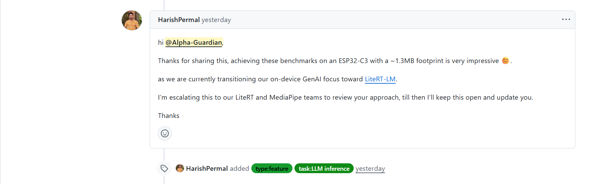

# Engram

We enable ten-yuan-class hardware to run reliable offline expert systems, with every decision fully auditable.

Engram is a low-cost offline edge intelligence stack for scenarios where important decisions cannot depend on cloud latency, cloud cost, or cloud trust. It is designed to turn a bounded expert capability into a replayable, auditable, and deployable device-side system.

This repository is the public showcase for that stack. It does not publish the private search, curriculum, or full training pipeline. It publishes the accepted public mechanism, replayable evidence for that mechanism, and a derived fixed-batch `ESP32-C3` board artifact.

## External Discussion

Engram has started to attract public attention from engineers working close to the Google and Espressif ecosystems around edge inference, language runtimes, and constrained-device deployment. The items below are all linked to public issue discussions. They show engineering interest and recognition, not a formal partnership or official endorsement.

- **Google DeepMind engineer and `gemma.cpp` co-creator Jan Wassenberg**
  He said that what amazed him most was that anything LLM-like could run on a single-core `160 MHz` CPU.

  <details>
  <summary>Source: <a href="https://github.com/google/gemma.cpp/issues/875#issuecomment-4097879728">gemma.cpp issue thread</a> · Screenshot</summary>
  <br>
  
  </details>

- **Google AI Edge / MediaPipe issue assignee HarishPermal**
  He said that achieving these results on `ESP32-C3` with an approximately `1.3MB` footprint was very impressive, and that he was escalating the project to the LiteRT and MediaPipe teams for review.

  <details>
  <summary>Source: <a href="https://github.com/google-ai-edge/mediapipe/issues/6253#issuecomment-4105713500">MediaPipe issue thread</a> · Screenshot</summary>
  <br>
  
  </details>

- **Espressif engineer and ESP-DL collaborator Sun Xiang Yu**
  He said that Engram was a very interesting project, and that its compressed, table-driven language runtime approach on `ESP32-C3` was inspiring for resource-constrained MCUs.

  <details>
  <summary>Source: <a href="https://github.com/espressif/esp-dl/issues/289#issuecomment-4079345100">ESP-DL issue thread</a> · Screenshot</summary>
  <br>
  
  </details>

## What It Is

Most edge AI deployments still face the same bad choice:

- send important decisions to cloud APIs, with higher latency, ongoing inference cost, and data-boundary pressure
- or stay fully local, but rely on brittle handwritten rules that break once several constraints must be weighed together

Engram takes a different path:

- keep bounded expert decision loops running locally on ten-yuan-class hardware
- make every accepted capability upgrade replayable and auditable
- preserve clear acceptance boundaries instead of shipping opaque edge behavior

In this repo, that means a frozen parent model can be upgraded into an accepted host surface, audited on the host, and then crystallized into a real `ESP32-C3` deployment artifact.

## Why It Matters

This approach is aimed at large real-world markets where cloud dependence is too slow, too costly, or unacceptable for compliance and safety reasons:

- `Industrial automation and plant gateways`: pump, motor, valve, and alarm-handling decisions inside factory gateways, utility cabinets, and field control boxes
- `Air-gapped security and government systems`: on-prem review terminals and security appliances in defense, government, and critical-infrastructure environments where sensitive inputs cannot leave site
- `Warehousing, robotics, and building control`: AGV coordination nodes, access-control panels, elevator controllers, and HVAC/building gateways that need deterministic local decisions
- `Power, battery, and energy equipment`: battery cabinets, EV charging controllers, microgrid boxes, and substation-side devices that must make bounded low-latency decisions offline

These are large infrastructure markets where the real product requirement is not "maximum generality." It is dependable local decision-making under cost, latency, safety, and compliance constraints.

## Why Engram Wins

What Engram does better than common alternatives:

- `Against cloud APIs`: it keeps the decision loop local, so latency, recurring inference cost, and sensitive data movement stay under control
- `Against pure rule engines`: it handles bounded multi-condition reasoning without turning every edge case into a large fragile rule tree
- `Against generic edge-model ports`: it does not just ship a smaller checkpoint; it also shows what capability was added, why it passed, what changed, and how regressions were checked

In practical terms, the advantage is:

- low-cost local decision execution on ten-yuan-class hardware
- auditable model capability upgrades instead of opaque checkpoint drift
- reproducible bounded deployment artifacts instead of host-only demos

## Current Public Evidence

- Same-parent gain is real and localized: official `LogiQA` improves from `0.303738` to `0.392523`; exact no-trunk ablation returns to `0.303738`.
- A second public task stays stable across the same-parent progression: official `IFEval` remains `0.780037` from frozen parent through the current surface.
- A true parent-derived industrial second-task line is now public: on `industrial_state_decision_logiqa_v2`, the independent line reaches `0.625` while frozen parent, exact no-trunk, and trained linear baseline each remain at `0.25`, and the transferred current surface reaches `0.375`.
- A fixed public second-line protocol now passes end to end: using a frozen public train source, external dev slice, blind slice, and `IFEval` non-regression monitor, the industrial candidate `5+6+8+10` reaches dev `0.2` and blind `0.5`, above parent/no-trunk/trained linear and above the transferred current surface on the blind slice.
- The frozen external union is now also public: across all `18` published external second-task samples, the same candidate reaches `0.333333` versus parent/no-trunk/trained-linear `0.166667` and transferred current `0.277778`.
- A lightly domain-shifted industrial wrapper probe now shows a positive same-parent transfer signal: current reaches `0.2` while frozen parent, exact no-trunk, and trained linear baseline each remain at `0.1`.
- A curated protected industrial-wrapper slice shows a cleaner localized transfer signal: current reaches `0.333333` while frozen parent, exact no-trunk, and trained linear baseline each remain at `0.166667`.
- Neighbor baselines under the same parent boundary do not reproduce the current surface (`BitFit-style`, `LoRA-style`, low-rank adapter-style, trainable-budget-matched LoRA-style, trainable-budget-matched adapter-style, retrieval-only, lexical-only).
- Board derivation is real: fixed-batch `ESP32-C3` proof reaches `249 / 642 = 0.3878504672897196` with `host_full_match = 642 / 642`.
- Board-side comparator bundle is now public: frozen parent reaches `194 / 642 = 0.302181`, trained linear baseline reaches `192 / 642 = 0.299065`, and both keep `host_full_match = 642 / 642`.
- Open-input is separated from board-proof claim: published `ESP32-C3` narrow micro-loop reaches `36 / 36` exact match with stability `1.0`.

Current boundary: this repo demonstrates feasibility, auditability, and a constrained deployment path. It does not claim broad unseen-family generalization or broad general reasoning on MCU hardware.

## At A Glance

| Item | Value |
|---|---|
| Innovation object | `frozen parent + residual-family local repair + coupled promotion gates + derived board artifact` |
| Current public host surface | official `IFEval = 0.780037`, official `LogiQA = 0.392523` |
| Public second-task check | same-parent progression keeps official `IFEval = 0.780037` throughout |
| Public independent second line | parent-derived industrial second line on `industrial_state_decision_logiqa_v2`: independent `0.625`, current `0.375`, parent `0.25`, no-trunk `0.25`, trained linear `0.25` |
| Public second-line protocol | train source `protected18`, dev `lite10`, blind `v2_8`, candidate `5+6+8+10`: dev `0.2`, blind `0.5`, `IFEval = 0.781885`, all gates pass |
| Public second-line external union | frozen external union over `18` published second-task samples: candidate `0.333333`, current `0.277778`, parent/no-trunk/trained linear `0.166667` |
| Public domain-shift probe | lightly domain-shifted industrial wrapper probe: current `0.2`, frozen parent `0.1`, no-trunk `0.1`, trained linear `0.1` |
| Protected transfer slice | curated industrial-wrapper slice: current `0.333333`, frozen parent `0.166667`, no-trunk `0.166667`, trained linear `0.166667` |
| Exact localization control | no-trunk ablation returns to official `LogiQA = 0.303738` |
| Additional controls | route-disabled `0.244548`, no-topology `0.280374`, depth-1 `0.323988`, target-only `0.308411`, trained linear `0.300623`, trained BitFit-style `0.266355`, trained LoRA-style `0.303738`, trained low-rank adapter-style `0.303738`, budget-matched LoRA-style `0.303738`, budget-matched adapter-style `0.303738`, retrieval-only `0.291277`, lexical-only `0.289720`, adapter controls `0.303738` |
| External guard | `external_dev = 0.308908`, `external_blind = 0.425072` |
| Paired official delta | `+0.088785`, exact McNemar `p = 7.658840702050266e-12` |
| Current block inventory | `75` trunk recurrent blocks = `72` `option_latent_v2` + `3` `pair_score` |
| Current retrieval footprint | `11,325` exemplars, `8192` GPU hash dim |
| Public board proof | `ESP32-C3`, `249 / 642 = 0.3878504672897196`, `host_full_match = 642 / 642` |
| Public board comparators | frozen parent `194 / 642 = 0.302181`, trained linear baseline `192 / 642 = 0.299065`, both `host_full_match = 642 / 642` |
| Public MCU open-input micro-loop | `ESP32-C3`, `36 / 36 exact match`, `stability = 1.0` |

## Start Here

- [docs/INNOVATION.md](docs/INNOVATION.md)
- [docs/METHOD.md](docs/METHOD.md)
- [docs/FAMILY_AND_ROUTING.md](docs/FAMILY_AND_ROUTING.md)
- [docs/TRUNK_BLOCKS.md](docs/TRUNK_BLOCKS.md)
- [docs/PROMOTION_CONTRACT.md](docs/PROMOTION_CONTRACT.md)
- [docs/EXPERIMENTS.md](docs/EXPERIMENTS.md)
- [docs/TRUST_AND_AUDIT.md](docs/TRUST_AND_AUDIT.md)
- [docs/BOARD_METRICS.md](docs/BOARD_METRICS.md)
- [docs/BOARD_POWER_ENERGY.md](docs/BOARD_POWER_ENERGY.md)
- [docs/OPEN_INPUT_DEMO.md](docs/OPEN_INPUT_DEMO.md)
- [docs/OPEN_INPUT_ROADMAP.md](docs/OPEN_INPUT_ROADMAP.md)

## What Is New

This repo now publishes a complete public evidence stack instead of only a board demo:

- `Mechanism`: residual-family routing, trunk recurrent blocks, and promotion gates
- `Evidence`: same-parent experiments, ablations, paired replay statistics, locality probes, and causal sequence results
- `Controls`: classic baselines, architecture-near controls, and budget-matched comparisons
- `Deployment`: fixed-batch `ESP32-C3` board proof plus separate host-side and MCU-side open-input demos
- `Audit`: overlap-controlled holdout, runtime, shadow, integrity, and board-side evidence

The public contribution is the coupled system: it turns family-local repairs into an audited accepted host surface and then into a bounded deployment artifact.

## What This Repo Proves

- A frozen authoritative parent can be improved on official `LogiQA` by a replayable accepted host surface while preserving the published external boundary.
- The current gain localizes to the promoted trunk blocks: removing them returns the checkpoint to parent-equivalent behavior on matched replays.
- The same frozen-parent trunk pipeline can instantiate a new independent industrial second-task capability line: on the published `industrial_state_decision_logiqa_v2` benchmark, the parent-derived line reaches `0.625` while frozen parent, exact no-trunk, and trained linear controls each remain at `0.25`.
- Under a fixed public second-line protocol with frozen train source, external dev, blind slice, and `IFEval` non-regression monitor, the candidate subset `5+6+8+10` passes every published gate and outperforms the transferred current surface on the blind slice.
- After freezing that protocol, the candidate also remains ahead on the combined external second-task surface (`18` samples total), not just on a single blind slice.
- A lightly domain-shifted industrial wrapper probe shows a same-parent positive signal (`0.2` vs `0.1`) while the exact no-trunk and trained linear controls stay at the frozen-parent level.
- A curated protected industrial-wrapper slice shows a cleaner same-parent localized transfer signal (`0.333333` vs `0.166667`) while exact no-trunk and trained linear controls stay at the frozen-parent level.
- Representative routed families can fire on their designated targets with zero observed collateral flips in the published narrow and protected slices.
- A small real open-input host loop can be run under the current surface with `exact_match_rate = 1.0` and `unsafe_guard_rate = 1.0` on the published structured taskset.
- A real `ESP32-C3` narrow open-input micro-loop can be run with `36 / 36` exact match and `stability_rate = 1.0` on the published board taskset.
- The accepted host-side surface can be crystallized into a real `ESP32-C3` fixed-batch artifact with exact host-full alignment on the published batches.

## Quick Start

See [docs/REPRODUCE.md](docs/REPRODUCE.md) for the full walkthrough.

Board path:

```bash
py scripts/flash_firmware.py COM3
py scripts/read_board_report.py COM3 --expect-mode logiqa_batch_compiled_probe --expect-artifact-sha256 626a1bfcc0a86585db82130744094ee4512eaaead8b4d9f1dba07175c010719d
```

Mode note:

- default single-batch board readback uses `evaluation_mode = logiqa_batch_compiled_probe`
- published 642 aggregate board-proof summary uses `evaluation_mode = logiqa_batch_compiled_probe_aggregated`

MCU open-input micro-loop path:

```bash
py scripts/flash_open_input_firmware.py COM3
py scripts/run_mcu_open_input_demo.py --port COM3
```

Board power/energy extension:

```bash
python3 scripts/run_power_phase.py --label mcu_open_input_36cmd --output results/board_power/mcu_open_input_36cmd_phase.json -- py scripts/run_mcu_open_input_demo.py --port COM3
python3 scripts/summarize_power_csv.py --csv path/to/logger_export.csv --label mcu_open_input_36cmd --start-s 20.10 --end-s 24.05 --output results/board_power/mcu_open_input_36cmd_power.json
```

Public-bundle verification:

```bash
python3 scripts/verify_public_bundle.py
```

Public experiment assets:

- [results/experiments/main_table.json](results/experiments/main_table.json)
- [results/experiments/cross_task_validation.json](results/experiments/cross_task_validation.json)
- [results/experiments/independent_industrial_second_line.json](results/experiments/independent_industrial_second_line.json)
- [results/experiments/industrial_second_line_protocol.json](results/experiments/industrial_second_line_protocol.json)
- [results/experiments/industrial_state_decision_probe.json](results/experiments/industrial_state_decision_probe.json)
- [results/experiments/industrial_wrapper_protected_slice.json](results/experiments/industrial_wrapper_protected_slice.json)
- [results/experiments/ablations.json](results/experiments/ablations.json)
- [results/experiments/additional_controls.json](results/experiments/additional_controls.json)
- [results/experiments/causal_sequence.json](results/experiments/causal_sequence.json)
- [results/experiments/locality_probes.json](results/experiments/locality_probes.json)
- [results/experiments/block_inventory.json](results/experiments/block_inventory.json)
- [results/experiments/manifest.json](results/experiments/manifest.json)
- [results/open_input_demo/host_open_input_demo.json](results/open_input_demo/host_open_input_demo.json)
- [results/open_input_demo/mcu_open_input_demo.json](results/open_input_demo/mcu_open_input_demo.json)
- [results/open_input_demo/mcu_open_input_taskset_v1.jsonl](results/open_input_demo/mcu_open_input_taskset_v1.jsonl)
- [results/open_input_demo/mcu_open_input_board_report.json](results/open_input_demo/mcu_open_input_board_report.json)
- [results/board_proof/board_baseline_comparison.json](results/board_proof/board_baseline_comparison.json)

## Repository Layout

- [docs](docs)
  - public method contract, experiments, audit boundary, and roadmap
- [results/experiments](results/experiments)
  - public-safe experiment tables and block inventory
- [results/open_input_demo](results/open_input_demo)
  - host-side structured open-input demo summary and MCU narrow open-input micro-loop evidence
- [results/research_line](results/research_line)
  - current accepted host surface manifest and guard bundle
- [results/audit](results/audit)
  - overfit and release-boundary evidence
- [results/board_proof](results/board_proof)
  - `ESP32-C3` board summary, acceptance, and raw batch reports
- [firmware](firmware)
  - published binaries for the board-proof line
- [scripts](scripts)
  - flashing, report readback, bundle verification, and maintainer summary export scripts
